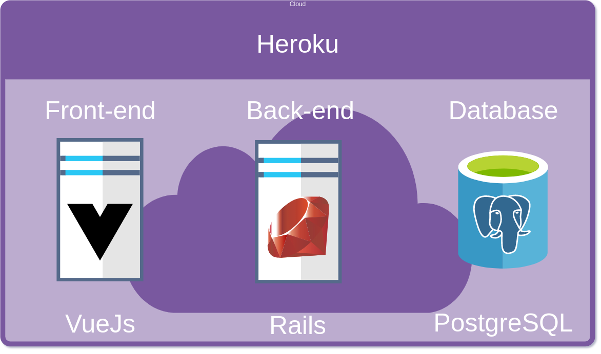
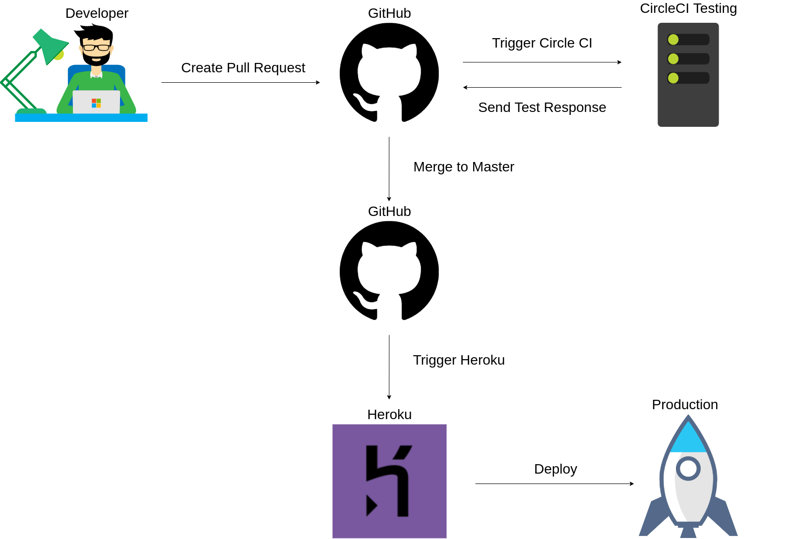

<h1 align="center">
    Herospark Challenge Front-end
</h1>

<p align="center">
  <a href="#rocket-technologies">Technologies</a>&nbsp;&nbsp;&nbsp;|&nbsp;&nbsp;&nbsp;
  <a href="#information_source-how-to-use">How To Use</a>&nbsp;&nbsp;&nbsp;|&nbsp;&nbsp;&nbsp;
  <a href="#black_square_button-architecture">Architecture</a>&nbsp;&nbsp;&nbsp;|&nbsp;&nbsp;&nbsp;
  <a href="#black_square_button-architecture">CI/CD</a>&nbsp;&nbsp;&nbsp;
</p>

## :rocket: Technologies

This project was developed for a test with the following technologies:


## :information_source: How To Use

To clone and run this application, you'll need [Git](https://git-scm.com) and [Docker and Docker Compose](https://docs.docker.com/compose/install/) on your computer. From your command line:

```bash
# Clone this repository
$ git clone https://github.com/Eronbello/book-app.git

# Go into the repository
$ cd book-app

# You can see the app running at: http://localhost:8080
$ docker-compose up
```

## :black_square_button: Architecture



## :black_square_button: CI/CD

